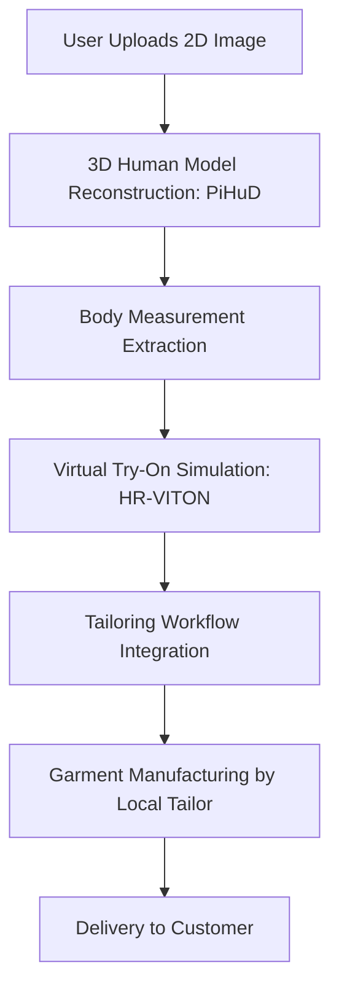
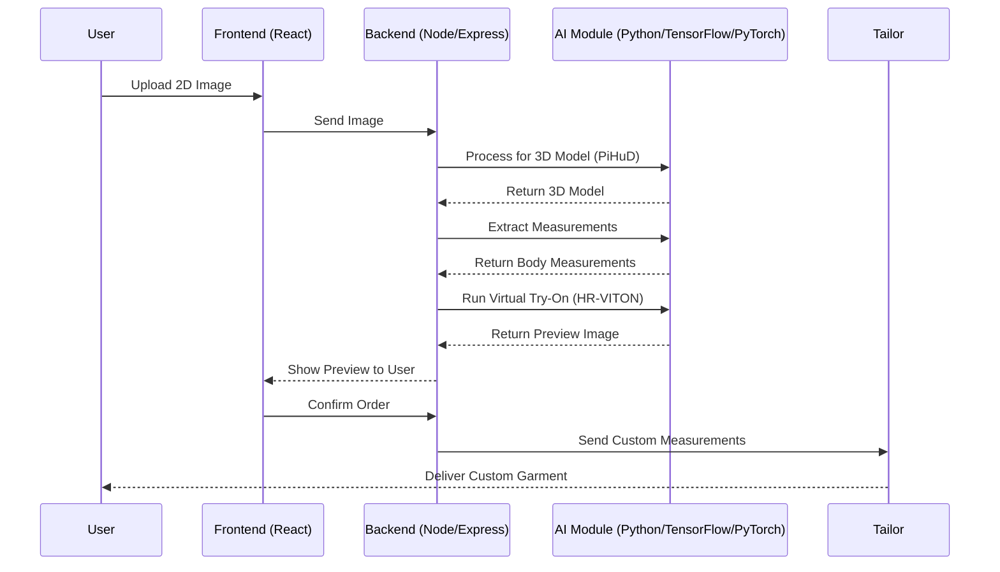
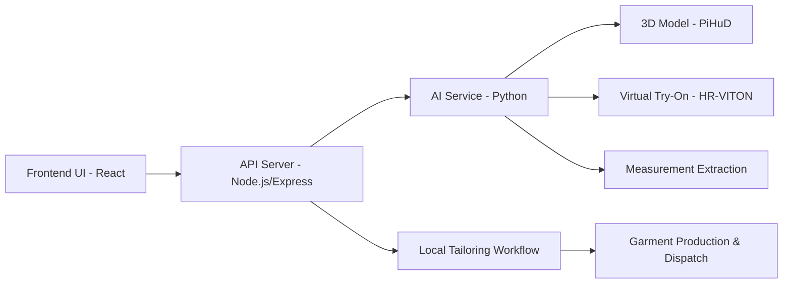

---

## 🧵 Tailor-Fit: AI-Powered Custom Garment Solution

Tailor-Fit is an innovative fashion-tech platform that bridges the gap between the precision of traditional tailoring and the convenience of online shopping. It combines **3D human body modeling**, **measurement extraction**, **virtual try-on**, and **custom tailoring services** to provide a scalable, personalized garment fitting experience.

---

### 📌 Features

* 📸 Single 2D image-based 3D human model reconstruction.
* 📏 Accurate body measurement extraction.
* 👕 Realistic virtual try-on simulation.
* 🧵 Integration with local tailoring services.
* 🌱 Sustainable shopping by reducing returns and overproduction.

---

### 🧠 Core Technologies

| Layer              | Tech Stack                      |
| ------------------ | ------------------------------- |
| Frontend           | React.js                        |
| Backend            | Node.js, Express.js             |
| AI/ML Models       | Python, TensorFlow, PyTorch     |
| Virtual Try-On     | HR-VITON                        |
| 3D Reconstruction  | PiHuD                           |
| Measurement Engine | Custom pipeline on 3D Mesh data |

---

## 🔧 System Architecture

### 📊 Flowchart Diagram



---

### 🕹️ Sequence Diagram



---

### 🧩 Component Architecture



---

## 🛠️ Installation & Setup

```bash
# Clone the repository
git clone https://github.com/your-username/tailor-fit.git
cd tailor-fit

# Setup backend
cd backend
npm install
npm start

# Setup frontend
cd ../frontend
npm install
npm run dev

# Setup AI models (in /ai-models directory)
# Follow individual instructions for PiHuD and HR-VITON

# Ensure Python packages are installed
pip install -r requirements.txt
```

---

## 🧪 Models Used

| Component              | Model        | Description                                         |
| ---------------------- | ------------ | --------------------------------------------------- |
| 3D Body Reconstruction | **PiHuD**    | Converts 2D image to 3D human mesh                  |
| Virtual Try-On         | **HR-VITON** | Warps garments onto body mesh for realistic try-on  |
| Measurement Extraction | Custom       | Calculates chest, waist, height, etc., from 3D mesh |

---

## 🌍 Contribution

We welcome contributions from the open-source community! Feel free to fork the repo, create a new branch, and submit a PR.

---

## 📄 License

This project is licensed under the [MIT License](LICENSE).

---
